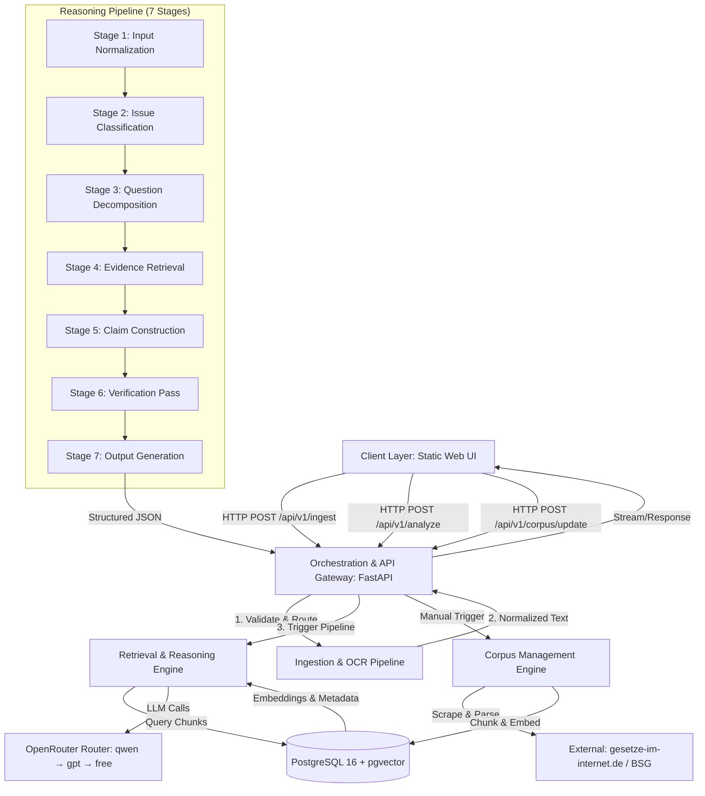

# DOCUMENT 1: DESIGN DOCUMENT
**System:** Citizen (v1.0)
**License:** MIT
**Target Platform:** Ubuntu (Primary), Windows/macOS (Secondary)
**Architecture Paradigm:** Local-First, Evidence-Constrained, Pipeline-Orchestrated

---

## 1. OVERVIEW & GOALS

The German Social Law Reasoning & Drafting System serves as a technical equalizer for citizens (Bürger) confronting the inherent power asymmetry of German social bureaucracy (e.g., Jobcenter, Sozialamt). By transforming opaque, often intimidating administrative correspondence into structured, evidence-backed legal assessments, the system enables individuals to understand their rights and obligations under the Sozialgesetzbuch (SGB) without requiring immediate, costly legal counsel. It automates the labor-intensive process of cross-referencing bureaucratic demands against current statutes and case law, ultimately producing a professional-grade draft response or a structured case presentation/initial analysis that can be presented upon a subsequent legal consultation in a meaningful way, and that adheres to formal legal requirements. This ensures that the user can mount a rigorous defense of their social entitlements based on facts and law, rather than being silenced by procedural complexity.

### 1.1 Concrete, Verifiable Goals
1. **Evidence-Bound Output Generation:** Every factual assertion, legal interpretation, and drafted clause in the final output must be explicitly bound to at least one retrieved legal source. Zero unsupported claims permitted.
2. **Deterministic 7-Stage Reasoning Pipeline:** All case analyses must traverse exactly seven sequential stages: Input Normalization → Issue Classification → Question Decomposition → Evidence Retrieval → Claim Construction → Verification Pass → Output Generation. Bypassing or reordering stages is architecturally prohibited.
3. **Cross-Platform Local OCR & Ingestion:** The system must ingest scanned bureaucratic documents (PDF/JPG/PNG) up to 25MB, normalize them to a deterministic 300dpi JPG standard, and extract text via a fully local, non-AI pipeline (`pdfplumber` → `PyMuPDF` → `Tesseract`). Maximum end-to-end pipeline latency: 120 seconds.
4. **Hierarchical Legal Corpus Management:** Statutory texts (SGB II/X), administrative guidance (Fachliche Weisungen), and jurisprudence (BSG) must be scraped, parsed, versioned, and chunked hierarchically (Statute → § → Absatz → Satz) with strict metadata tagging. Corpus updates are manually triggered in v1.
5. **Question-Driven Retrieval & Reranking:** Retrieval must operate on decomposed legal questions, not raw user queries. The system must enforce top-k diversity across source layers, prioritize normative law, and attach verifiable metadata to every retrieved chunk.
6. **Mandatory 6-Part Output Structure:** All generated responses must strictly conform to: (1) Sachverhalt, (2) Rechtliche Würdigung, (3) Ergebnis, (4) Handlungsempfehlung, (5) Entwurf eines Schreibens, (6) Unsicherheiten/fehlende Informationen.
7. **Future-Proof Single-User Architecture:** v1 operates as a single-seat, local tool with no authentication. The underlying schema, API contracts, and session management must be explicitly structured to support multi-tenant RBAC, persistent case history, and cloud deployment without architectural refactoring.

### 1.2 Explicit Non-Goals
- **No Automated Corpus Updates:** v1 requires manual user initiation for legal database synchronization. Scheduled/automated updates are deferred to post-v1.0.
- **No External OCR or Vision APIs:** All document processing occurs locally. Cloud-based OCR is explicitly excluded to maintain data locality and zero-cost operation.
- **No Multi-User Authentication or RBAC in v1:** The system assumes a single local operator. Auth scaffolding is reserved for future monetization phases.
- **No Silent Assumptions or Forced Conclusions:** If evidence is insufficient, the system must explicitly flag uncertainty in Section 6 of the output. Hallucination or speculative legal advice is architecturally blocked.
- **No Terminal-Only Interface:** A lightweight, self-contained local web UI is mandated for cross-platform consistency and document upload ergonomics.

---

## 2. SYSTEM ARCHITECTURE

### 2.1 Component Breakdown
The system is decomposed into six logically isolated, API-mediated components:

1. **Client Layer (Static Web UI):** A self-contained HTML/JS/CSS frontend served directly by the FastAPI backend. Handles document upload, progress streaming, disclaimer acknowledgment, and structured output rendering. Communicates exclusively via REST/JSON.
2. **Orchestration & API Gateway (FastAPI):** Central request router. Manages session state, validates payloads, triggers pipeline stages sequentially, enforces latency timeouts, and streams partial results to the client. Implements the deterministic LLM router.
3. **Ingestion & OCR Pipeline:** Local, synchronous processing module. Accepts raw files, enforces the 25MB limit, applies the standardized 300dpi JPG conversion (quality 84, EXIF stripped), executes the three-tier text extraction fallback chain, and returns normalized UTF-8 text.
4. **Corpus Management & Chunking Engine:** Manual-trigger scraper/parser for official German legal repositories. Implements hierarchical parsing, metadata enrichment (effective dates, source type, jurisdiction), and vector embedding generation. Writes directly to PostgreSQL.
5. **Retrieval & Reasoning Engine:** Stateless pipeline executor. Decomposes normalized text into explicit legal questions, queries `pgvector` with diversity constraints, constructs evidence-bound claims, runs a verification pass against source text, and formats the final 6-part output.
6. **Data Layer (PostgreSQL 16 + pgvector):** Unified persistence layer. Stores legal sources, hierarchical chunks, dense embeddings, case run metadata, claim-evidence bindings, and audit logs. Enforces ACID compliance and strict referential integrity.

### 2.2 Architectural Flow (Mermaid.js)

---

## 3. DATA MODEL

### 3.1 Conceptual Entities & Relationships
The data model is strictly relational with vector extensions. All entities support temporal versioning and auditability.

| Entity | Description | Relationships |
|--------|-------------|---------------|
| `legal_source` | Root record for a legal document (e.g., SGB II, BSG Urteil B 14 AS 12/23). Contains metadata: title, type, jurisdiction, effective_date, source_url. | 1:N → `legal_chunk` |
| `legal_chunk` | Hierarchical unit of law. Bound to a specific `source_id`. Contains `unit_type` (statute, paragraph, absatz, satz), `text_content`, `hierarchy_path` (e.g., `SGB II > § 31 > Abs. 1 > Satz 2`). | 1:1 → `chunk_embedding` |
| `chunk_embedding` | Dense vector representation of `legal_chunk.text_content`. Stored via `pgvector`. Includes `model_name` and `created_at`. | N:1 → `legal_chunk` |
| `case_run` | Represents a single analysis session. Contains `session_id`, `input_text`, `status`, `created_at`, `latency_ms`, `llm_fallback_chain`. | 1:N → `pipeline_stage_log`, 1:N → `claim` |
| `pipeline_stage_log` | Immutable audit record for each of the 7 stages. Stores `stage_name`, `input_snapshot`, `output_snapshot`, `duration_ms`, `error_trace`. | N:1 → `case_run` |
| `claim` | Atomic legal assertion generated in Stage 5. Contains `claim_text`, `confidence_score`, `claim_type` (fact, interpretation, recommendation). | 1:N → `evidence_binding` |
| `evidence_binding` | Explicit link between a `claim` and one or more `legal_chunk` records. Contains `binding_strength`, `quote_excerpt`, `chunk_id`. | N:1 → `claim`, N:1 → `legal_chunk` |

### 3.2 Persistence Strategy
- **Primary Store:** PostgreSQL 16. All relational data uses strict `NOT NULL` constraints, foreign keys, and `CHECK` constraints for enum validation.
- **Vector Store:** `pgvector` extension. `chunk_embedding` table uses `vector(1536)` (or model-specific dimension). Indexing via `IVFFlat` or `HNSW` for sub-50ms retrieval.
- **Versioning:** Legal sources use `effective_date` and `superseded_by_id` to track amendments. Chunks inherit versioning from parent sources.
- **Auditability:** `pipeline_stage_log` and `evidence_binding` tables are append-only. Deletion is prohibited; soft-deletion via `is_active` flag only.

---

## 4. API / INTERFACE DESIGN

### 4.1 External Interfaces
The system exposes a RESTful API over HTTP/1.1. All endpoints return JSON. The frontend is served statically at `/` and communicates via `/api/v1/*`.

| Endpoint | Method | Purpose | Payload/Response |
|----------|--------|---------|------------------|
| `/api/v1/ingest` | POST | Upload document, run local OCR, return normalized text | `multipart/form-data` → `{ "text": "...", "metadata": {...} }` |
| `/api/v1/corpus/update` | POST | Trigger manual legal database scrape & chunking | `{ "source_type": "sgb2" }` → `{ "status": "queued", "job_id": "..." }` |
| `/api/v1/analyze` | POST | Execute full 7-stage pipeline | `{ "input_text": "...", "session_id": "..." }` → `{ "output": { "sachverhalt": "...", ... }, "claims": [...], "bindings": [...] }` |
| `/api/v1/cases/{id}` | GET | Retrieve historical case run (schema-ready, disabled in v1 UI) | `{ "case_run": {...}, "stages": [...], "claims": [...] }` |

### 4.2 Protocols & Authentication
- **Protocol:** HTTP/1.1 with JSON payloads. Streaming via Server-Sent Events (SSE) for pipeline progress updates.
- **Authentication:** v1 operates without auth. All endpoints accept requests from `localhost`/`127.0.0.1`. Architecture reserves `Authorization: Bearer <JWT>` header and `X-Session-ID` for future multi-user deployment.
- **Rate Limiting:** Local-only. No external rate limits enforced. LLM router handles provider-side `429` responses internally.

[PATCH D1-API-01] DISCLAIMER ENFORCEMENT PROTOCOL
All `/api/v1/*` endpoints require explicit disclaimer acknowledgment prior to execution. The system enforces this via:
1. Versioned Consent: `DISCLAIMER_VERSION` (default: "v1.0.0") is hardcoded in backend config and exposed via `GET /api/v1/meta/disclaimer`.
2. Client-Side Storage: Acknowledgment is stored in `localStorage` under key `legal_disclaimer_accepted_v1` with value `{"version": "v1.0.0", "timestamp": "<ISO8601>", "ip_hash": "<SHA256>"}`.
3. Request Validation: All POST/PUT requests must include header `X-Disclaimer-Ack: v1.0.0`. Missing or mismatched versions return `HTTP 403 Forbidden` with `{"error": "disclaimer_acknowledgment_required", "current_version": "v1.0.0"}`.
4. Auditability: Backend logs acknowledgment events (version, timestamp, session ID) to pipeline_stage_log with stage_name="disclaimer_ack". No PII is stored. IP hashing uses SHA-256 with a static, application-managed salt. To ensure zero user friction, the system automatically generates a cryptographically secure salt on first startup and persists it locally to a .secret_salt file. The user is never prompted to configure this.
5. Graceful Degradation: If `localStorage` is cleared, UI re-blocks interaction until re-acknowledgment. No silent bypass permitted.

---

## 5. SECURITY & INFRASTRUCTURE

### 5.1 Security & Compliance
- **Data Locality:** All document processing, OCR, and database operations run locally. Only normalized text (stripped of EXIF/metadata) is transmitted to OpenRouter for LLM inference.
- **Disclaimer Enforcement:** UI mandates explicit acknowledgment of a liability disclaimer before first use. Disclaimer text is hardcoded and versioned.
- **Secrets Management:** API keys, DB credentials, and routing thresholds stored in `.env`. Loaded via `pydantic-settings` at startup. Never logged or exposed in responses.
- **GDPR Posture:** v1 assumes personal use. No PII retention policy enforced at the application layer. User bears responsibility per disclaimer. Architecture supports future data anonymization pipelines.

[PATCH D1-SEC-01] GERMAN COMPLIANCE ALIGNMENT
- Explicit Consent (BGB § 305c, TMG § 15): Disclaimer acknowledgment is opt-in, versioned, and revocable via UI reset.
- Data Minimization (DSGVO Art. 5): Only acknowledgment metadata (version, timestamp, hashed session) is logged. No raw IP, no device fingerprinting.
- Transparency: `DISCLAIMER.md` is served verbatim via `GET /api/v1/meta/disclaimer/text`. Frontend renders exact bilingual text.
- Liability Containment: Acknowledgment does not waive statutory rights under German law (BGB § 309 Nr. 7), but establishes informed consent for AI-generated outputs and third-party LLM routing.

### 5.2 Deployment Targets & Resource Requirements
- **Primary Target:** Ubuntu 22.04/24.04 LTS. Docker Compose for local orchestration (`fastapi-app`, `postgres-16`).
- **Secondary Targets:** Windows 10/11 (WSL2 recommended), macOS 13+ (Apple Silicon supported via `pgvector` ARM builds).
- **Minimum Resources:** 8GB RAM, 4 CPU cores, 20GB SSD. PostgreSQL requires ~4GB for initial corpus + embeddings. OCR pipeline peaks at ~2GB RAM during Tesseract execution.
- **Network:** Outbound HTTPS to OpenRouter API. Inbound HTTP/WS to `localhost:8000`. No inbound ports exposed externally.

---

## 6. KEY DESIGN DECISIONS

### 6.1 PostgreSQL 16 + pgvector over Dedicated Vector DB
**Rationale:** Legal reasoning requires strict ACID compliance, referential integrity between claims and source chunks, and deterministic versioning. A separate vector database (e.g., Pinecone, Weaviate) introduces network latency, eventual consistency risks, and complex sync logic. `pgvector` co-locates embeddings with relational metadata, enabling single-query joins (`JOIN legal_chunk ON chunk_id = ... WHERE embedding <-> query < threshold`), simplifying backup/restore, and guaranteeing zero architectural changes when migrating to cloud-hosted PostgreSQL later.

### 6.2 Hierarchical Chunking (Statute → § → Absatz → Satz)
**Rationale:** Sliding-window chunking destroys legal boundaries, causing citation hallucination and cross-paragraph context bleed. German administrative law relies on precise structural references. Hierarchical chunking preserves exact legal units, enables metadata tagging at each level, and allows the retrieval engine to enforce diversity constraints across structural tiers. This guarantees that every retrieved chunk maps to a verifiable, citable legal boundary.

### 6.3 Deterministic OpenRouter Fallback Chain
**Rationale:** Reliability is a hard constraint. OpenRouter provides a unified API surface for multiple providers. The chain `qwen/qwen3.6-plus` → `openai/gpt-5.4-nano` → `/openrouter/free` ensures availability during rate limits, provider outages, or quota exhaustion. The router is implemented synchronously with exponential backoff and circuit-breaker logging. This eliminates single-point-of-failure risks while maintaining cost predictability.

### 6.4 Local-First OCR with Standardized 300dpi JPG Output
**Rationale:** Cloud OCR APIs violate data locality principles and introduce variable latency/cost. Standardizing all inputs to a single 300dpi JPG (quality 84, EXIF stripped) before Tesseract execution eliminates format variability, ensures deterministic OCR behavior across OS platforms, and caps memory usage. The three-tier PDF fallback (`pdfplumber` → `PyMuPDF` → Tesseract) maximizes text extraction accuracy while maintaining strict local execution.

### 6.5 Ephemeral v1 Execution with Persistent Schema
**Rationale:** The roadmap requires early testability and human-verifiable work packages. Implementing a fully persistent case history UI in v1 introduces unnecessary complexity. By designing the schema to support `case_run` and `pipeline_stage_log` from day one, but defaulting the v1 API/UI to session-scoped ephemeral execution, we satisfy immediate testing requirements while preserving a zero-friction migration path to persistent history, multi-user RBAC, and SaaS monetization.

### 6.6 Question-Driven Retrieval over Direct Query Matching
**Rationale:** Bureaucratic letters contain mixed facts, procedural demands, and implicit legal threats. Direct vector similarity matching against raw text yields irrelevant chunks. Decomposing the case into explicit legal questions (e.g., "Were procedural requirements under § X met?") aligns retrieval with legal reasoning patterns. This enables targeted querying, cross-source aggregation, and strict top-k diversity enforcement, directly supporting the evidence-bound output requirement.

---
